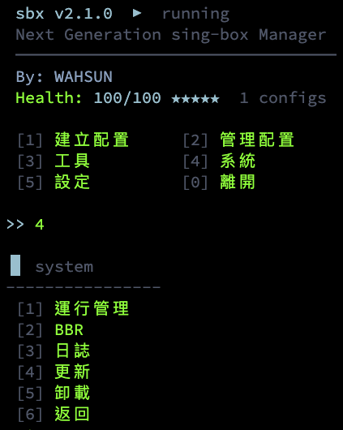
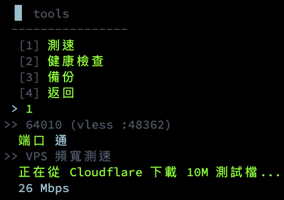
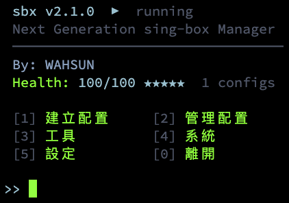

<p align="right">
  <a href="README.en.md">English</a> | <b>繁體中文</b>
</p>

# sbx — Next Generation sing-box Manager

> Modern sing-box Management Framework — 純 Bash、主題化、插件可擴展。

[](LICENSE)
[]()
[]()

---

## 特性

✓ **純 Bash 零依賴** · ✓ **6 種主題** · ✓ **雙語**（繁中/EN）· ✓ **Plugin 擴展** · ✓ **Health 評分** · ✓ **Atomic JSON** 安全寫入

---

## 截圖

| 主選單 | 工具列表 | 運行畫面 |
|:---:|:---:|:---:|
|  |  |  |

---

## 快速安裝

```bash
bash <(curl -sL https://raw.githubusercontent.com/C92D58/Sbx/main/install.sh)
```

**本地安裝：**

```bash
git clone https://github.com/C92D58/Sbx.git && cd Sbx
bash install.sh -l
```

---

## 核心命令

| 命令 | 說明 |
|------|------|
| `sbx` | 互動儀表板 |
| `sbx add <protocol>` | 添加配置（reality / tuic / hy2 / trojan / ss …） |
| `sbx check` | 健康檢查（含評分） |
| `sbx theme` | 主題切換 |

📖 [完整命令手冊](docs/commands.md)

---

## 儀表板

```
  sbx v2.0  ▶  running
  Next Generation sing-box Manager

  [1] Create    [2] Manage
  [3] Tools     [4] System    [5] Settings
  [0] Exit
```

---

## 支援協議

VLESS-REALITY · VLESS-WS-TLS · VLESS-H2-TLS · VMess-WS-TLS · Trojan-WS-TLS · TUIC · Hysteria2 · Shadowsocks · AnyTLS · SOCKS5

---

## 文件

[命令手冊](docs/commands.md) · [主題指南](docs/themes.md) · [插件開發](docs/plugins.md)

---

## 法律責任

> ⚖️ **僅供技術學習與合法用途**
>
> 本工具（sbx）僅供技術學習、研究與合法用途使用。使用者須自行遵守所在地法律法規，不得將本工具用於任何違法活動（包括但不限於規避網路審查、非法存取、侵犯他人權益等）。
>
> 因使用本工具造成的任何直接或間接後果，作者（WAHSUN）概不負責。使用本工具即表示您已閱讀並同意本聲明。
>
> ⚖️ *Legal Disclaimer: This tool is provided for educational and lawful purposes only. Users are solely responsible for compliance with applicable laws. The author assumes no liability for any consequences arising from the use of this software.*

---

## 安全

`jq --arg` 防注入 · `tmp + mv` 原子寫入 · `mktemp -d` 安全暫存

---

## 致謝

sing-box 核心 [SagerNet/sing-box](https://github.com/SagerNet/sing-box) · 作者 **WAHSUN** · [GPL-3.0](LICENSE)
